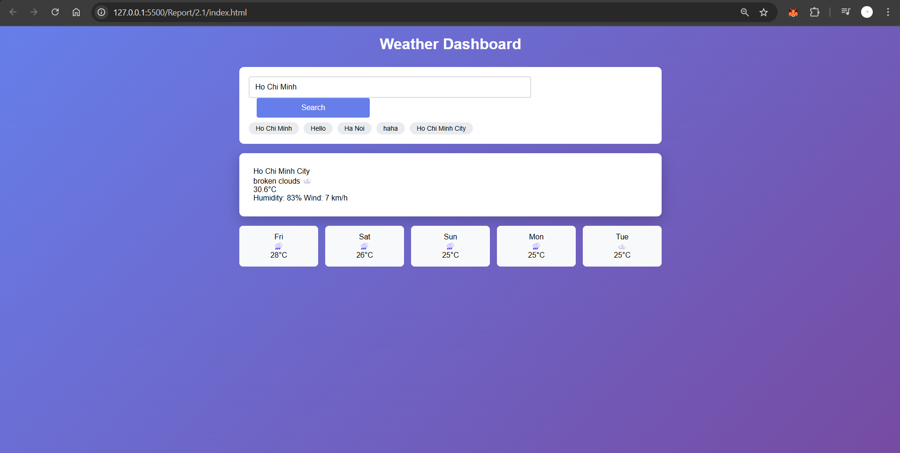

# 🌤️ Weather Dashboard
---
##  Preview

---
## Features
✅ Search weather by city name
✅ Display current temperature, humidity, wind speed, and conditions
✅ Show 5-day forecast with weather icons (emojis)
✅ Loading and error handling states
✅ Save and display recent searches (stored in localStorage)

---

## API Integration
This project uses the free [OpenWeatherMap API](https://openweathermap.org/api):
* **Current Weather:**
  ```
  https://api.openweathermap.org/data/2.5/weather?q={city}&appid={API_KEY}&units=metric
  ```
* **5-Day Forecast:**
  ```
  https://api.openweathermap.org/data/2.5/forecast?q={city}&appid={API_KEY}&units=metric
  ```
> Note: Replace `YOUR_API_KEY_HERE` in the script with your actual OpenWeatherMap API key.
---
## How It Works
1. User enters a city name and clicks **Search**.
2. The app fetches weather data using `fetchWeather(city)` and forecast data using `fetchForecast(city)`.
3. Data is displayed using `displayWeather()` and `displayForecast()`.
4. The search term is saved to **localStorage** for quick access later.
5. Loading and error states are shown for better UX.
---

##  Function explain
* **async fetchWeather(city)**

Fetches current weather data from the OpenWeatherMap API.
Parameters: city – the city name entered by the user.
Returns: A JSON object containing weather data.
Error Handling: Throws an error if the response code is not OK (e.g., city not found).

* **async fetchForecast(city)**

Fetches 5-day forecast data for the given city.
Parameters: city – the city name.
Returns: JSON data with multiple time intervals.
Only forecasts for 12:00 PM are shown (using .filter()).

* **displayWeather(data)**

Displays current weather info (temperature, humidity, wind, description).
Extracts values like:

data.name → City name

data.main.temp → Temperature

data.weather[0].description → Weather description

Adds corresponding weather emoji via getWeatherEmoji().

* **displayForecast(data)**

Shows forecast for the next 5 days in a grid.
Filters API data where dt_txt includes "12:00:00".
Displays day name, weather emoji, and temperature.

* **getWeatherEmoji(main)**

Returns an emoji matching the weather condition (☀️, ☁️, 🌧️, etc.).
Called by both displayWeather() and displayForecast().

* **async searchWeather(cityName)**

Main function that handles search logic.

Reads user input or uses provided cityName.

Clears any old errors.

Displays “Loading...” while waiting.

Calls both fetchWeather() and fetchForecast().

Displays results and saves city to recent searches.

Catches and shows errors if something goes wrong.

* **saveRecentSearch(city)**

Stores the searched city in localStorage (max 5 recent entries).
Removes duplicates and refreshes the “Recent Searches” display.

* **loadRecentSearches()**

Loads saved cities from localStorage and shows them as clickable buttons.
Clicking one triggers searchWeather(city) again.

* **showError(message) / clearError()**

Manages the error message area at the top of the page.
showError() displays a red warning banner.
clearError() removes it.

-------------------------------------------------------------------------------------------

# 🐙 GitHub Repository Finder

##  Preview


##  Features
Search repositories by keyword
Sort by:
⭐ Stars
🔱 Forks
🕒 Recently Updated
Display repository details:
Name, description, stars, forks, language
Owner username
Link to repository
“Load More” pagination (10 repos per page)
Handles GitHub rate limit and error messages
---

##  Function Explanations

* **async searchRepositories(query, sort = 'stars', page = 1)**

Calls the GitHub search API:
https://api.github.com/search/repositories?q=${query}&sort=${sort}&page=${page}&per_page=10
Purpose: Fetch repositories matching a search keyword.
Returns: A JSON response with:
total_count – total results available
items[] – array of repository objects
Error Handling:
Shows error if API rate limit exceeded (403).
Throws an error if search fails.
displayRepositories(repos, append = false)
Renders the repository list in the HTML.
If append is false → replaces all previous results.
If true → adds new results below existing ones (for pagination).
Each repository is rendered using createRepoCard(repo).

* **createRepoCard(repo)**

Creates a single repository card element showing:
Repo name (with GitHub link)
Description
Stars ⭐ (stargazers_count)
Forks 🔱 (forks_count)
Language badge
Owner info (owner.login)
This function returns an HTML string used inside displayRepositories().

* **async performSearch()**

Triggered when user clicks Search or presses Enter.
Reads text input value and selected sort option.
Resets currentPage to 1.
Calls searchRepositories() to get results.
Clears old error messages.
Displays new repository cards.
Creates or hides the “Load More” button depending on result count.

* **async loadMore()**

Called when user clicks Load More Results.
Increments currentPage.
Fetches the next 10 repositories using searchRepositories().
Appends new cards using displayRepositories(repos, true).

* **getSortValue()**

Retrieves the user’s selected sorting option (stars, forks, or updated) from the <select> dropdown.
Used by both performSearch() and loadMore().

* **showError(message) / clearError()**

Manages the red error box above results.
Displays error messages like:
“No results found”
“Rate limit exceeded”
“Network error”