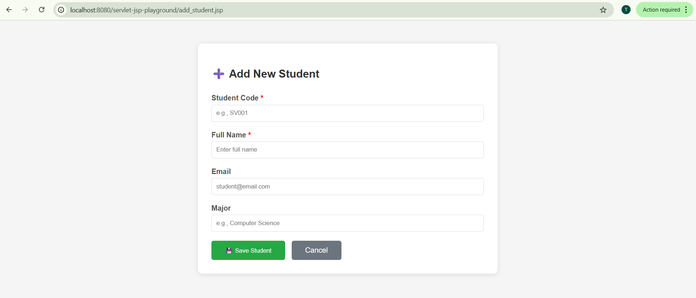
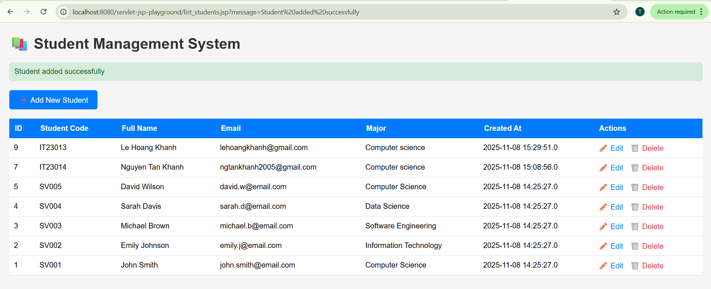
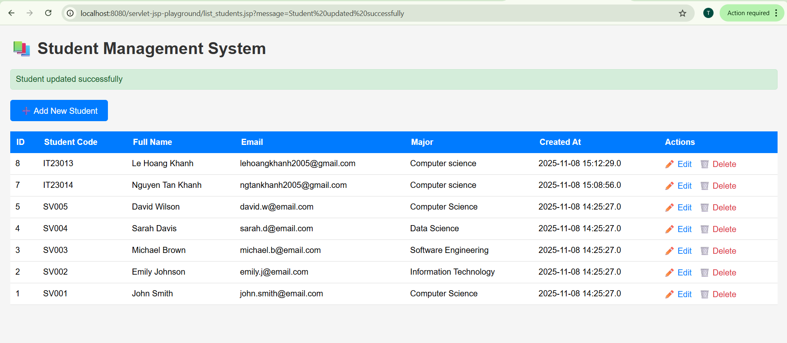

# 🚀 LAB 4 EXERCISES: JSP + MYSQL - CRUD OPERATIONS
> Course: Web Application Development
> Name: Pham Trung Kiên
> ID: ITCSIU23020
> Tutor: Nguyen Trung Nghia

# PART A: IN-CLASS EXERCISES (60 points)

## EXERCISE 1: SETUP AND DISPLAY (15 points)
### Task 1.1: Project Setup 

### Task 1.2: Display Student List (10 points)

## EXERCISE 2: CREATE OPERATION (15 points)

### Task 2.1: Create Add Student Form (5 points)

> ✨ When click on the add button it link to the add_student.jsp

### Task 2.2: Process Add Student (10 points)

> When click on submit button it will execute the process_add.jsp and process_add file only has java code, therefore it not display
> All the error of user input will be handle in process_add.jsp and present on the add_student.jsp
> Then successfull go to the list_student page

## EXERCISE 3: UPDATE OPERATION (15 points)

### Task 3.1: Create Edit Form (7 points)

> Click on update button action edit_student is call move to that jsp file with form already load data from database
> Then edit 
### Task 3.2: Process Update (8 points)
> The same to add_process

## EXERCISE 4: DELETE OPERATION (15 points)

### Task 4.1: Implement Delete (10 points)

