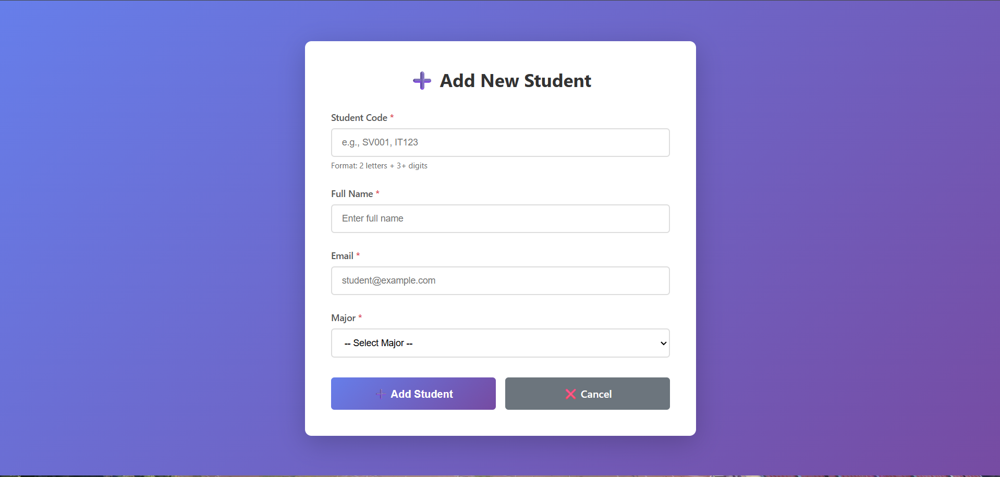
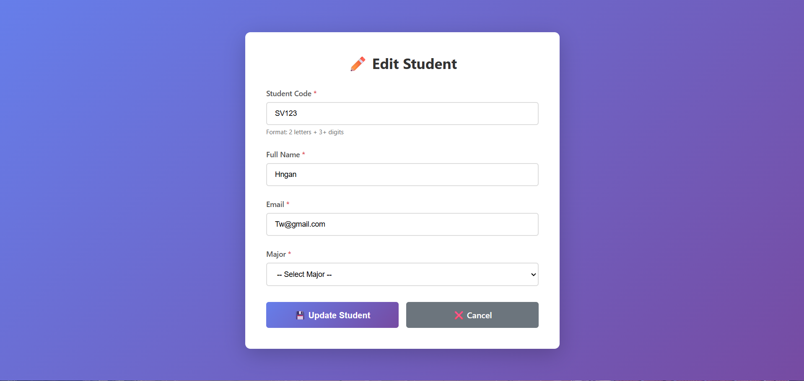

STUDENT INFORMATION:
Name: Phạm Trung Kiên
Student ID: ITCSIU23020
Class: 1h15 - 4h30 Saturday

# MVC COMPONENTS:
- **Model: Student.java**
- **DAO: StudentDAO.java**
- **Controller: StudentController.java**
- **Views: student-list.jsp**

# Lab 5 Report: MVC Code Flow Analysis

## Key Components

### Model -- Data & business logic

-   **Student.java** -- JavaBean (POJO) representing a student.
-   **StudentDAO.java** -- Data Access Object for MySQL operations.

### View -- UI layer

-   **student-list.jsp** -- Displays all students.
-   **student-form.jsp** -- Form for adding/editing a student.

### Controller -- Handles requests & connects Model ↔ View

-   **StudentController.java** -- Main servlet.

------------------------------------------------------------

# 1. Code Flow: Create a New Student

## Part A --- Show "Add New Student" Form (GET)

User clicks **"Add New Student"** → Browser sends:
    GET /student?action=new
### Controller
-   Calls `showNewForm()`, forwards to `student-form.jsp`.
### View
-   `${student == null}` → empty form displayed.

## Part B --- Submit the Form (POST → Redirect → GET)
User submits the form → Browser sends:
    POST /student (action=insert)
### Controller
-   Calls `insertStudent()`, DAO runs INSERT SQL.
### Browser
-   Redirects to list page after PRG pattern.
------------------------------------------------------------------------
# 2. Code Flow: Update an Existing Student
## Part A --- Show "Edit Student" Form (GET)
    GET /student?action=edit&id=5
Controller loads student → forwards to form → fields pre-filled.

## Part B --- Submit Update (POST → Redirect → GET)
    POST /student (action=update&id=5)
DAO runs UPDATE SQL → Redirect back to list.

------------------------------------------------------------------------
# 3. Code Flow: Delete a Student
## Delete Flow
    GET /student?action=delete&id=5
DAO runs DELETE SQL → Redirect → List reloads without student.

------------------------------------------------------------------------

